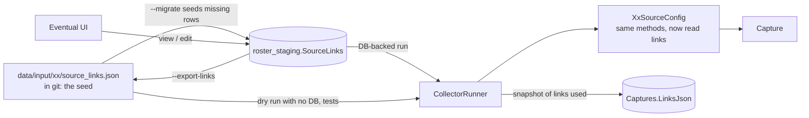

# Plan: store source links in the database

> **Status, 2026-10-08: phases 1–5 built, not yet committed.** Decisions taken: the database
> value wins on `--migrate`; one seed file per state; election ids included; nothing
> downstream reads the old `sources.json`. Differences from the plan below:
> - **Parameters share the seed file.** `source_links.json` has a `parameters` section
>   instead of a separate file, so a state's links and ids are edited in one place.
>   `election_ids.json` is gone.
> - **Ballotpedia links were removed** (they were never fetched, only listed in
>   `sources.json`). Their code literals went too, so no URL is left in collector code.
>   The `verification` link kind remains for any cross-check link added later; with none,
>   `sources.json` has `"verification_only": []`.
> - **The URL equivalence check was a one-off**, not a committed per-state test: all 147
>   URLs across years 2024–2028, both election types and sample ids matched the old code
>   exactly. A committed copy would fail every time someone legitimately edits a seed
>   URL. The permanent tests check the template engine, that every implemented state's
>   seed file loads, and that seed files are in the format `--export-links` writes.
> - **`WaSourceConfig.MeasureDetailUrl` was dropped**, since nothing called it.
> - **TX, WV, WA and CA** take links the same way but are still not on `StateCollectorBase`.
>
> Verified: 170 output files identical across all 17 states when normalized from the same
> captures, with links from the seed files and from the database (before the Ballotpedia removal); a live stored capture of
> all 17 fetched exactly the same URLs, with matching election, candidate and measure counts;
> fresh-schema migrate, second-migrate no-op, drift report, export, reseed and an
> export of all 17 that reproduced the seed files byte for byte.

Draft, 2026-10-08. Goal: every state's source URLs live in the staging database so the eventual UI can view and edit them. A seed file per state in git restores them every time a dev database is wiped and re-created with `--migrate`.

Related: [`workflowMap.md`](workflowMap.md) (the Links Index workflow step), [`db/README.md`](db/README.md) (staging schema and migrations).

---

## 1. Where links live today, and why that has to change

| What | Where | Problem |
| --- | --- | --- |
| The URLs a collector fetches | `src/StateBallot.States.Xx/XxSourceConfig.cs`, as C# properties and methods (often built from the year or election type) | Editing a link means editing code and redeploying. A UI can't reach them. |
| `data/input/<xx>/sources.json` | Tracked in git, in the *input* folder | Looks like link config, and has the right shape (links grouped by role, each with a format), but **nothing reads it**. `ResultWriter` overwrites it on every export with the URLs a run used. It's an output in the input folder. |
| Hand-maintained election ids | `data/input/nm/election_ids.json`, `data/input/sd/election_ids.json`, HI's `BootstrapElectionId` in code | Same issue: the values people actually change each cycle aren't editable without a commit. |

`sources.json` is the model for what we want: a per-state list of links with roles and formats. This plan makes that real: a seed file per state that the code reads, loaded into a database table the UI can edit.

### What kinds of links exist (all 17 states)

| Kind | Example | How it's stored |
| --- | --- | --- |
| Fixed URL | VA `https://www.elections.virginia.gov/casting-a-ballot/candidate-list/` | URL as is |
| Built from the year | NC `.../Elections/{year}/Candidate%20Filing/Candidate_Listing_{year}.csv` | Template with `{year}` |
| Differs by election type | MD primary → `primary_candidates/{year}_GP_...csv`, general → `general_candidates/{year}_GG_...csv` (also CO, VT, WY, CA) | **One row per type** (a `variant` of `primary` / `general`), each a plain template. This removes the type-to-path logic from code entirely. |
| Takes an id or code | NM/SD/MT `CandidateList.aspx?eid={electionId}`, HI `?elid={electionId}`, WA `voterguide.ashx?e={electionId}&c={countyCode}` | Template with `{electionId}`, `{countyCode}`, `{raceId}` |
| Found during the run | CO's XLSX link inside the candidate page, VA's election page, SD's calendar page | **Not stored as config.** Only the page they're found on is configured. What was found is already recorded per run in `CaptureFetches`, and the UI can show it as "last seen". |
| Home / check-by-hand page | The URL in the "refusing to write hollow outputs" error (`SourceHomeUrl`) | A link of kind `home` |
| Verification only | `https://ballotpedia.org/Maryland_elections,_{year}` | A link of kind `verification`, never fetched |

Not links, and out of scope: WebForms button names (MS, HI), CSS selectors and regexes, and TX/MS extra request headers. Headers fit naturally as a per-link fetch option later (see section 8).

---

## 2. The design in one picture



The rules:
- **The seed file in git is the bootstrap and the reviewable copy.** It survives every database wipe.
- **The database is what runs use**, and what the UI edits.
- **`--migrate` fills in missing rows and never overwrites an edited one.** It reports any row that differs from the seed.
- **`--export-links` writes the database back to the seed files**, so a UI edit worth keeping can be committed before the next wipe.

---

## 3. Seed file format

One file per state, `data/input/<xx>/source_links.json`, next to the state's other inputs. `key` reuses the fetch role the collector already tags downloads with (`FetchTag.Of(CandidateListRole, …)`), so a link joins to the `CaptureFetches` rows it produced.

```json
{
  "state": "MD",
  "links": [
    { "key": "home", "kind": "home",
      "url": "https://elections.maryland.gov" },
    { "key": "elections-page",
      "url": "https://elections.maryland.gov/elections/{year}/index.html", "format": "html",
      "notes": "Yearly page; Primary/General Election Day in a <dl>. Past elections are commented out." },
    { "key": "candidate-list", "variant": "primary",
      "url": "https://elections.maryland.gov/elections/{year}/primary_candidates/{year}_GP_statewide_candidatelist.csv", "format": "csv" },
    { "key": "candidate-list", "variant": "general",
      "url": "https://elections.maryland.gov/elections/{year}/general_candidates/{year}_GG_statewide_candidatelist.csv", "format": "csv" },
    { "key": "ballotpedia", "kind": "verification",
      "url": "https://ballotpedia.org/Maryland_elections,_{year}", "format": "html" }
  ]
}
```

Placeholders are a closed set: `{year}`, `{electionId}`, `{countyCode}`, `{raceId}`. An unknown placeholder, or one left unfilled, throws. A link never silently resolves to a broken URL.

---

## 4. Database

New migration `M005_SourceLinks` in `roster_staging` (the pipeline's own schema, not `vote`).

**`SourceLinks`**: one row per (state, key, variant).

| Column | Type | Notes |
| --- | --- | --- |
| `SourceLinkId` | INT identity | PK |
| `StateCode` | ANSI 2 | |
| `LinkKey` | ANSI 64 | Matches the fetch role |
| `Variant` | ANSI 32, default `''` | `primary` / `general` / empty |
| `UrlTemplate` | TEXT | |
| `Format` | ANSI 16, nullable | html, csv, xlsx, pdf, json |
| `Kind` | ANSI 16, default `fetch` | `fetch`, `home`, `verification` |
| `Notes` | TEXT, nullable | Shown on the Links and State Details pages |
| `IsActive` | BOOL, default 1 | Lets the UI retire a link without deleting its history |
| `UpdatedAt`, `UpdatedBy` | DATETIME, ANSI 100 | `UpdatedBy = 'seed'` for rows the seeder wrote |

Unique key on (`StateCode`, `LinkKey`, `Variant`).

**`Captures.LinksJson`** (JSON, nullable): a snapshot of the links a capture used. A capture made after a UI edit can then be explained and re-run, the way `GitSha` explains code. Without it, the History Log can't say why two captures fetched different URLs.

Follow the existing migration rules in `db/README.md`: `AsAnsiString`, `AsCustom` for TEXT and JSON, never edit an applied migration, and update the README table in the same change.

---

## 5. Seeding on `--migrate`

`Migrator.ApplyAsync` gets a second step after the schema migrations: `LinkSeeder`. Both the CLI's `--migrate` and the console's startup call `ApplyAsync`, so both get it with no extra wiring.

Seeding is **not** a FluentMigrator migration. Migrations are frozen once applied, and seed content changes all the time.

For each row in every `source_links.json`:

| Database has… | Seeder does |
| --- | --- |
| No row | Insert it (`UpdatedBy = 'seed'`) |
| Same row as the seed | Nothing |
| A row that differs | **Keep the database value.** Report: `MD candidate-list/primary differs from seed (edited by alex 2026-10-07)` |
| A row the seed doesn't have | Keep it. Report it as database-only. |

On a freshly wiped database, every row is inserted, so the database matches git after one `--migrate`, which is the main dev loop. On a long-lived database, UI edits survive a deploy.

New CLI commands:
- `--export-links [XX]`: writes database rows back into the seed files. Run it before wiping a database whose edits you want to keep, then commit.
- `--reseed-links [XX]`: overwrites database rows from the seed files. This is the explicit "git wins" reset.

---

## 6. How collectors read links

The collectors themselves don't change. Each `XxSourceConfig` keeps its methods (`StatewideCandidateListUrl(year, kind)`, etc.), but they resolve from a loaded link set instead of hard-coded strings:

```csharp
// before
public string StatewideCandidateListUrl(int year, string kind) { /* folder + prefix logic */ }
// after
public string StatewideCandidateListUrl(int year, string kind) =>
    Links.Url("candidate-list", variant: kind, year: year);
```

- **`SourceLinkSet`** (Core): an in-memory set for one state, with `Url(key, variant, …placeholders)`. It can load from a seed file or from database rows.
- **Choosing the source:** a run with a staging database loads from `SourceLinks`. A `--dry-run` with no database (`docker compose run --no-deps`) and tests load from the seed file. The run logs which one it used. If a DB-backed run finds no rows for the state, it fails and says to run `--migrate`, rather than quietly falling back to the file.
- **Getting it into the collector:** `CollectorDiscovery.BuildCtorArgs` already assigns constructor arguments by type, so it learns to pass a `SourceLinkSet` parameter. `StateCollectorBase` takes it and builds the config from it. `SourceHomeUrl` can then default to the `home` link, which removes the override from each state.
- **Tests:** tests that inject a config (TX) build a `SourceLinkSet` in memory.

---

## 7. Phases

Each phase leaves the pipeline working and can be committed on its own.

**Phase 0: finish what's open.** Commit the base-class work for the 13 states. Optionally convert TX, WV, WA and CA to the base class first. That isn't required, since links reach collectors through the config classes, but it means only one way to build a collector.

**Phase 1: links become data (files only, no database).**
1. Write `source_links.json` for all 17 states from the current `SourceConfig` code.
2. Add `SourceLinkSet` and the file loader.
3. **Before deleting any hard-coded URL**, add an equivalence test per state: for years 2024–2028 and every variant and id, the new config returns exactly what the old code returned. The old values are frozen into the test as expected strings.
4. Switch each `SourceConfig` to read from the link set, and delete the hard-coded strings.

The result: same behavior, but every URL is data in git.

**Phase 2: the database.**
1. `M005_SourceLinks` (table + `Captures.LinksJson`).
2. `LinkSeeder` inside `Migrator.ApplyAsync`, with the drift report.
3. A DB-first loader in `CollectorRunner`, and a links snapshot on each capture.

**Phase 3: dev-loop commands.** `--export-links` and `--reseed-links`. Document the loop in `db/README.md`: wipe, `--migrate`, edit, `--export-links`, commit.

**Phase 4: the other hand-edited values.** Move NM/SD `election_ids.json` and HI's bootstrap election id into the same pattern: a small `SourceParameters` table (state, key, value, notes) with a seed file, seeded the same way. These are the values most likely to be edited every cycle, so they matter most for the UI.

**Phase 5: tidy `sources.json`.** Stop writing it into `data/input/`. Write it beside the other exports in the output root. The pass's `SourcesJson` column already holds the same thing in the database. Delete the tracked copies and update the `sync-roster-data.sh` note that says it stays in inputs.

**Later (UI work, not this plan):** a read/write API over `SourceLinks`, a `SourceLinkChanges` history table (who changed what, old → new) for the History Log, a "last seen" column from `CaptureFetches` joined on `LinkKey`, and per-link fetch options (headers, WebForms postback, eventually headless browser).

---

## 8. How we'll know nothing broke

| Check | Proves |
| --- | --- |
| Per-state equivalence tests (Phase 1) | Every URL the new config builds matches the old code, offline |
| Live `--capture-only` per state before and after, comparing method + URL + role in `fetch_log.json` | Collectors fetch exactly the same things |
| `--normalize` of the same capture before and after, `diff -r` of the outputs (the check used for the base-class change) | Output is byte-for-byte identical, including `sources.json` URLs |
| `docker compose down -v && up`, then `--migrate` twice | Fresh seeding works, and a second run is a no-op |
| Edit one row, `--migrate` again, then `--export-links` | Edits survive migrate, are reported as drift, and round-trip to the file |

---

## 9. Decisions to confirm

1. **Conflict rule on `--migrate`: database wins (recommended) or seed file wins?** "Database wins" protects UI edits but means a seed change in git doesn't reach an existing database until `--reseed-links`. Since dev databases are wiped often, they'd pick up seed changes anyway.
2. **Seed file location: per state in `data/input/<xx>/source_links.json` (recommended) or one combined file?** Per-state matches every other input and keeps diffs small.
3. **Include Phase 4 (election ids) in this round?** Recommended, since those are what changes each cycle.
4. **Phase 5: is anything downstream reading `data/input/<xx>/sources.json`** (the data repo, the console)? If so, it needs to move to the new location first.
