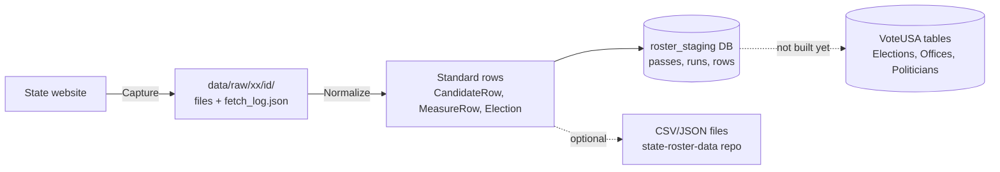

# How the code maps to the workflow

A plain-language tour of what is in this repo, which part of the final workflow each piece belongs to, and what still has to be built. Snapshot as of 2026-10-08 (branch `raw-capture`).

For deep technical detail see [`configDrivenPipelineInfo.md`](configDrivenPipelineInfo.md) (how it works) and [`configDrivenPipelinePlan.md`](configDrivenPipelinePlan.md) (what's next). For the database see [`db/README.md`](db/README.md).

---

## 1. The 30-second version

Today the pipeline is a **command-line tool plus a MySQL staging database**. There is no UI in this repo yet. Every run does two things:

1. **Capture**: download every source file or page for one state and year, and save it to disk exactly as received.
2. **Normalize**: read those saved files (never the internet), turn them into one standard shape for elections, candidates and measures, and store the result in the database.

Because the two stages are separate, you can fix a parser or a mapping and re-run step 2 against the same downloaded files without scraping again. Most of the workflow depends on that.

---

## 2. What's in the repo

| Folder | What it is, in plain words |
| --- | --- |
| `src/StateBallot.Cli/` | The command you run. Reads the flags (`--state`, `--year`, `--normalize`, …) and starts a run. Very thin. |
| `src/StateBallot.Staging/` | The run engine and the database layer. `CollectorRunner` runs capture then normalize. The writers save results. `Migrations/` defines the staging tables. |
| `src/StateBallot.Core/` | Shared toolbox every state uses: downloading (`HttpFetcher`), saving raw files (`Raw/`), parsers for CSV, XLSX and HTML tables, date/address/text clean-up, the standard data shapes (`Models.cs`), OCD division ids, file export. |
| `src/StateBallot.States.Xx/` (17 of them) | One folder per state. Each holds the same handful of files (see below). |
| `src/StateBallot.*.Tests/` | Offline tests, one project per state plus Core and Staging. |
| `src/StateBallot.Tools/` | Generates `db/schema.sql` from VoteUSA's own table definitions. |
| `data/input/` | Settings files: the 50-state catalog plus per-state config (date formats, field maps, selectors, county FIPS). |
| `data/raw/` | Downloaded source files, one folder per capture. Gitignored, and only the newest 3 per state are kept. |
| `db/` | Local MySQL in Docker: a slice of the VoteUSA schema (`vote`) and the pipeline's own `roster_staging` schema. |
| `.github/workflows/`, `scripts/` | Publishing outputs to the `vote-usa/state-roster-data` repo. |

### The shape of a state folder

Every state follows the same layout, which makes them easy to compare:

| File | Job | Workflow part |
| --- | --- | --- |
| `XxSourceConfig.cs` | Named accessors for the state's URLs, which live in `data/input/<xx>/source_links.json` and the `SourceLinks` table | Links Index |
| `XxSelectors.cs` | Where on a page to find things (CSS selectors and regexes) | Scrape / Header Mapping |
| `XxCollector.cs` | `CaptureAsync` (what to download) and `Normalize` (how to read it) | Scrape + Normalize |
| `XxCandidateMapper.cs` | Turns one raw row into a standard `CandidateRow` | Header Mapping + Normalization |
| `XxPublishSchedule.cs` | Suggests when to run again | Workflow Control |
| `*Scraper.cs`, `*Client.cs` | Helpers for finding elections or calling a state API | Scrape |

---

## 3. Workflow parts, mapped to code

Status legend: ✅ built · 🟡 partly built or foundation only · ⬜ not started

### Pipeline Status View (view past runs): 🟡 data ready, no screen

All the data for this view is already recorded. It needs a screen.

- **Tables:** `Captures` (each download session: who, when, status, file count, bytes, log), `CaptureFetches` (every single request: URL, status, size, time, error), `CollectionPasses` (each normalize: counts, gaps, log, error), `Runs` (one row per election in a pass).
- **Code that writes them:** `Staging/CaptureWriter.cs`, `Staging/RunWriter.cs`.
- **Worth knowing:** one capture can have many passes, because every re-normalize is a new pass. The screen should show it as a tree: capture → passes → elections. `PassUnassignedRows` lists rows that couldn't be tied to an election, and should be visible here too.

### Secretary of State Links Index (view and edit links): 🟡 data ready, no screen

- **Built:** every URL a collector fetches is a row in `roster_staging.SourceLinks`, with each state's home page. Hand-kept election ids are in `SourceParameters`. Runs read them from the database, so an edit there takes effect on the next capture. See "Source links" in [`db/README.md`](db/README.md) and [`linkStoragePlan.md`](linkStoragePlan.md).
- **Seeded from git:** `data/input/<xx>/source_links.json`. `--migrate` fills in missing rows without overwriting edits, `--export-links` writes edits back to the files, and `--reseed-links` resets from them.
- **`data/input/state_catalog.json`** lists all 50 states + DC and whether each is implemented. That's the natural backbone for this page.
- **Harder than it looks:** many states don't have one fixed URL. They start from an index page and follow links to find the real files (MT, NM, CO, …). Only the **entry point** is a configured link. The URLs found from it are recorded per capture in `CaptureFetches`, and a link's `LinkKey` matches the fetch role, so the two join.
- **To build:** the screen itself (read/write over `SourceLinks` and `SourceParameters`), a change-history table, and a "last seen working" column from `CaptureFetches`.

### State Details Page: 🟡 assembled from other parts

It isn't a separate subsystem. It puts together the state's links, mapping files (`data/input/<xx>/`), recent captures and passes, and the narrative notes already written per state in `configDrivenPipelineInfo.md` and each collector's top-of-class comment (e.g. `MdCollector` explains what it covers and what it skips on purpose).

### Workflow Control: 🟡 engine ready, no queue

- **Built:** `Staging/CollectorRunner.cs` is one entry point shared by the CLI and a future web console. `Staging/RunRequest.cs` already has `Source = "web"`, `ExistingPassId` for passes queued by a UI, and `CollectionPasses` has `queued` status and `CancelRequested`. The design expects a console that queues jobs. That console is not in this repo.
- **Controls that already exist as flags:** capture only, normalize an existing capture, single election, dry run, Wayback replay, retention.
- **Scheduling hint:** each state's `XxPublishSchedule` writes a `next_run` recommendation, which could drive automatic runs.
- **Limit to plan around:** the runner redirects console output to record the log, so **only one run at a time per process**. A job runner needs to run them one after another or in separate processes.

### Scrape and Store Raw Data: ✅ the most complete part

- **Code:** `Core/HttpFetcher.cs` (downloads; can rewrite to Wayback), `Core/Raw/RawSink.cs` (saves every payload plus `fetch_log.json`), `Core/Raw/FetchTag.cs` (labels each download, e.g. `candidate-list {type: general}`, so normalize can find it again), `Core/Raw/CaptureReader.cs` (reads it back), `Core/Raw/RawRetention.cs` (prunes old captures), `Staging/CaptureWriter.cs` (DB records).
- **Per state:** the `CaptureAsync` half of each `XxCollector`, plus its scrapers and clients. `Core/WebFormsPostback.cs` handles sites behind ASP.NET forms (HI, MS).
- **Gap:** 10 states sit behind Cloudflare, Akamai and similar. They need a headless-browser fetch option that doesn't exist yet (see the plan doc).

### Header Mapping Config (map scraped headers to standard fields): 🟡 simple fields only

- **Built:** `data/input/<xx>/candidate_field_map.json` maps standard field → that state's column name, e.g. `"Party": "Office Political Party"`. `Core/CandidateFieldMapper.cs` applies it. 13 of the CSV/XLSX states have one.
- **Not covered, on purpose:** Office, District and Candidate Name are always in code, because every state needs some logic for them (splitting "State Senate District 12", joining first and last names). Party suffix stripping, city/state/zip splitting and choosing between phone columns are also still code.
- **Other config already split out:** `date_formats.json` (every state), `selectors.json` (CA, WA), `election_type_names.json` (TX), `election_ids.json` (NM, SD).
- **Why this is buildable:** because capture and normalize are separate, a mapping screen can work like this: edit the map → re-normalize a saved capture (`--normalize <id>`) → preview the rows. No re-scraping.
- **To build:** a list of named, reusable value transforms (split, strip, join, pick-first-non-empty) a user can attach to a field, so the map covers more than plain one-column-to-one-field copies.

### Data Normalization: ✅ built, per state

- **The standard shape:** `Core/Models.cs` has `Election`, `CandidateRow`, `MeasureRow`, `CountyDirectoryRow` and `CountyBallot`. Rule: a value the source doesn't publish stays null and is never guessed.
- **Per state:** the `Normalize` half of each `XxCollector` plus `XxCandidateMapper`.
- **Shared clean-up:** `TextNormalization`, `DateParsing`/`DateFormatConfig`, `AddressFormatting`, `RowHelpers`, `CollectResultSorter` (stable order), `ScrapeGuard` (fail loudly on empty pages).
- **After normalizing:** `Staging/ElectionMatcher.cs` assigns each row to its election, and `Staging/RunWriter.cs` adds OCD division ids (`Core/OcdDivisionId.cs`) and stores everything.

### Match to Existing Data / Deduplication: ⬜ placeholders only

- `Core/Deduplicator.cs` only removes duplicates **inside one download** (used by TX and WV).
- The tables already have columns for matching to VoteUSA: `Runs.ElectionKey`, `RunCandidates.OfficeKey` / `PoliticianKey` / `*ResolveStatus` / `ResolveReason`. **Nothing fills them yet.**
- `db/README.md` lists the target keys (`ElectionKey = {ST}{yyyyMMdd}{type}{party}`, `PoliticianKey = {ST}{Last}{First}…`). The `SourceCandidateId` and `SourceOfficeId` fields on rows were added so these matches can be made reliably.

### View Data History Log: 🟡 foundation only

Every pass is kept, never overwritten. Each one records its capture, git commit, who ran it and payload hashes, so you can trace a row back to the exact file it came from. What's missing is a **diff between passes** ("3 candidates added, 1 withdrawn since last week"). `RunCandidates.Status` (e.g. "Withdrawn - 02/19/2026") will matter here.

### Data Approval: ⬜ not started

The only related piece is the `vote.Security` table, which has users scoped to a state (`wvadmin` for WV) for console sign-in. No approval states or tables exist.

### Data Exporting: 🟡 file export only

- **Built:** `Core/ResultWriter.cs` + `OutputWriter.cs` write CSV/JSON when `--output-root` is given. `scripts/sync-roster-data.sh` and the **Publish roster data** GitHub Action push them to `vote-usa/state-roster-data`.
- **Not built:** writing approved data into the VoteUSA tables. The `vote` schema and a `RosterProvenance` table are ready for it.

---

## 4. Summary table

| Workflow part | Status | Where it lives |
| --- | --- | --- |
| Pipeline Status View | 🟡 data yes, UI no | `Captures`, `CaptureFetches`, `CollectionPasses`, `Runs` tables |
| Links Index | 🟡 data yes, UI no | `SourceLinks` / `SourceParameters` tables, `data/input/<xx>/source_links.json`, `Staging/LinkStore.cs` |
| State Details | 🟡 composite | everything under `data/input/<xx>/` + DB + docs |
| Workflow Control | 🟡 engine yes, queue no | `Staging/CollectorRunner.cs`, `RunRequest.cs`, `Cli/Runner.cs` |
| Scrape & Store Raw | ✅ | `Core/HttpFetcher.cs`, `Core/Raw/*`, `XxCollector.CaptureAsync` |
| Header Mapping Config | 🟡 simple fields | `candidate_field_map.json`, `CandidateFieldMapper.cs`, `XxCandidateMapper.cs` |
| Data Normalization | ✅ | `Core/Models.cs`, `XxCollector.Normalize`, Core helpers, `RunWriter.cs` |
| Match / Dedup | ⬜ | empty resolution columns in `Runs` / `RunCandidates` |
| History Log | 🟡 | append-only passes + payload hashes |
| Approval | ⬜ | none |
| Exporting | 🟡 files only | `ResultWriter.cs`, publish workflow |

---

## 5. Stepping back: thoughts on the architecture and the workflow

**The two-stage split is the backbone. Keep it.** Capture-then-normalize turns the workflow into three loops that run at different speeds:

1. **Acquire** (slow, polite, sometimes blocked): Links → Scrape & Store Raw.
2. **Interpret** (fast, offline, repeatable): Header Mapping → Normalization, re-run as often as needed against a saved capture.
3. **Decide** (human): Match → History/diff → Approval → Export.

Your six "built" parts are loops 1 and 2. The rest is loop 3. Designing the UI around these loops, not as eleven separate pages, will keep it coherent. For example, the Header Mapping screen should have a "re-normalize capture #N and preview" button, because the architecture already supports it.

**Decide where editable config lives before building the UI.** Today config is JSON in git, and URLs are C# code. A UI that edits links and mappings needs a home for those edits. Options: (a) the UI writes JSON and commits it, so changes are reviewable but slower to apply, or (b) config moves into the database with versions. Whichever you pick, **record the config version on each pass**, the way the git commit is recorded now. Otherwise a pass made from an unsaved UI edit can't be reproduced, and the History Log loses its value.

**Be realistic about how much is "config".** The plan doc already concluded, after 17 states, that finding elections and splitting office/district differ too much between states to configure. Expect a mixed model: config covers column mapping, date formats, selectors and entry-point URLs, and a per-state code module covers discovery and the tricky fields. The UI should show which fields are config-driven and which are code-driven, so nobody expects to edit something they can't.

**A few naming and plumbing fixes would make the UI easier:**
- Raw retention (keep newest 3) can delete files a pass still points to. Once Approval exists, never prune a capture that an approved pass came from.
- The one-run-per-process limit (console output capture) shapes how Workflow Control queues jobs.
- `Status` means three things: a capture's status, a run's status, and a candidate's filing status (`RunCandidates.Status`). Label them clearly in the UI.

**Matching is the next real engineering problem, not a UI problem.** Approval and export to VoteUSA both depend on rows already having `OfficeKey` and `PoliticianKey`. The columns and source ids are in place. The matching logic (and a review queue for uncertain matches) is the missing core that loop 3 depends on.

**Fetch strategy belongs in Scrape & Store.** The 10 blocked states need a headless-browser option chosen per source. When the Links page exists, "how to fetch this URL" (plain, custom headers, WebForms postback, browser) is a natural per-link setting next to the URL.
